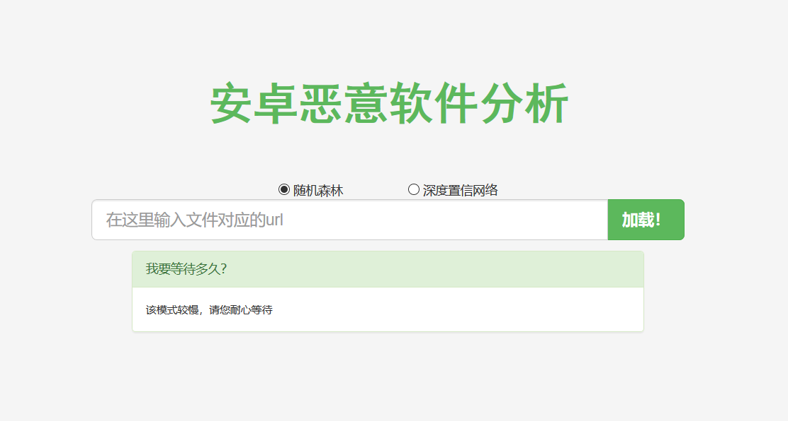
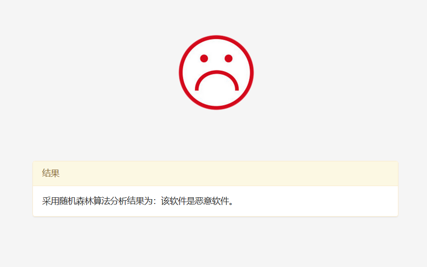

# AndroidMalwareDetection
## Intruction
毕设做的项目（almost cost 10 days），静态特征提取的安卓恶意软件检测，用到了深度置信网络和随机森林。
项目非常没把握，但还是做完了。我的数据集比较小，导致测试集几乎和训练集准确率相同，故在此仅提供一些方法。
检测方式思路来自[https://github.com/maoqyhz/DroidCC](https://github.com/maoqyhz/DroidCC)
## 获取数据集
借助爬虫从小米商店获得良性app，从VisualShare获得恶意app
## 静态特征提取(feature_extraction)
通常使用的静态特征为
1、权限（permission）
2、API（method）
3、字符串

其中危险权限有：
``` 
READ_PHONE_STATE
WRITE_CALL_LOG
ANSWER_PHONE_CALLS
READ_CALL_LOG
READ_PHONE_NUMBERS
ADD_VOICEMAIL
USE_SIP
PROCESS_OUTGOING_CALLS
CALL_PHONE
BODY_SENSORS
SEND_SMS
RECEIVE_SMS
READ_SMS
RECEIVE_WAP_PUSH
RECEIVE_MMS
READ_EXTERNAL_STORAGE
WRITE_EXTERNAL_STORAGE
READ_CALENDAR
WRITE_CALENDAR
CAMERA
```
敏感API有：
``` python
Sensitive_APIs = { 
    #log
    #0 : [ "Landroid/util/Log;","d"],
    #send sms
    1: ["Landroid/telephony/SmsManager;","sendTextMessage"],
    #read sms
    2: [".","getDisplayMessageBody"],
    3: [".","getMessageBody"],
    #IMEI
    4: ["Landroid/telephony/TelephonyManager;","getDecicedId"],
    #phone number
    5: ["Landroid/telephony/TelephonyManager;","getLine1Number"],
    #get Sim serial
    6: ["Landroid/telephony/TelephonyManager;","getSimSerialNumber"],
    #Location
    7: ["Landroid/telephony/TelephonyManager;","getCellLocation"],
    #GPS
    8: [".","getLastKnownLocation"],
    9: [".","requestLocationUpdates"],
    #Recorder
    10: ["Landroid/media/MediaRecorder;","prepare"],
    #native_code
    11: ["Ljava/lang/Runtime;","exec"],
    12: ["Ljava/lang/Runtime;","load"],
    13: ["Ljava/lang/System;","load"],
    #file io
    14: ["Llibcore/io/IoBridge;", "open"],
    15: ["Llibcore/io/IoBridge;", "read"],
    16: ["Llibcore/io/IoBridge;", "write"],
    17: ["Ljava/io/File;", "create"],
    18: ["Ljava/io/File;", "delete"],
    19: ["Ljava/io/File;", "get"],
    20: ["Ljava/io/File;", "mk"],
    21: ["Ljava/io/File;", "set"],
    #get resource
    22: [".","openRawResource"],
    23: [".","getAssets"],
    #http
    24: ["Lorg/apache/http/impl/client/AbstractHttpClient;", "execute"],
    25: ["Ljava/net/HttpURLConnection;","connect"],
    26: ["Ljava/net/URL;","openConnection"],
    27: ["Ljava/net/URLConnection;","connect"],
    28: ["Ljava/net/Socket;","."],
    #ssl
    29: ["Ljavax/net/ssl;","."],
    #WebView
    30: ["Landroid/webkit/WebView;","addJavascriptInterface"],
    31: ["Landroid/webkit/WebView;","searchBoxJavaBridge_"],
    #load jar
    32: ["Ldalvik/system/DexClassLoader;","."],
    33: ["Ljava/net/URLClassLoader;","."],
    34: ["Ldalvik/system/PathClassLoader;","."],
    #ReflectionCode
    35: ["Ljava/lang/reflect/Method;", "."],
    #encrypt or SHA
    36: [".", "doFinal"],
    37: [".","digest"],
    #use camera
    38: ["Landroid/hardware/Camera;","open"],
    #query SQL(read contact\SMS)
    39: ["Landroid/content/ContentResolver;","query"],
    #SharedPreferences
    40: ["Landroid/content/SharedPreferences;","edit" ],
    #sendBroadcast
    41: [".","sendBroadcast"],
    42: [".","sendOrderedBroadcast"],
    43: [".","sendStickyBroadcast"],
    44: [".","sendStickyOrderedBroadcast"],
    #start activity
    45: [".","startActivity"],
    46: [".","startActivityForResult"],
    #Service
    47: [".","startService"],
    48: [".","bindService"],
    #write to SD card ,add by Colbert 20150120
    49: [".","getExternalStorageDirectory"],
    #input check ,add by Colbert 20150120
    50: [".","readLine"]
}
```
## 机器学习(model_train)
将上述特征以向量形式送进DBN和RF中进行训练,进行不断调参，得到一个准确度较高的模型。
并将训练好的模型存储下来。（数据集大的时候，会训练很久）
## 展示(show)
用Flask框架完成设计，加载back中的模型
检测界面

检测结果


## 后言
感谢小伙伴goxy和Daemon的帮助！顺便吐槽下导师啥都不给指导。
还好顺利毕业2333
